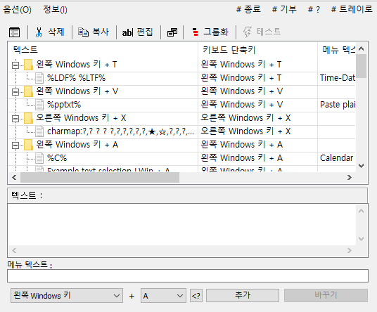
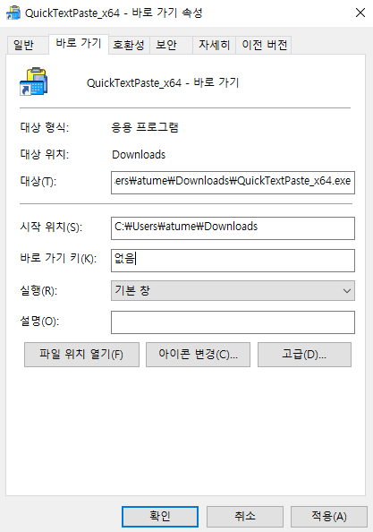

# Markdown command 단축키 Ver.1 (Window)

&nbsp;
- `git status`, `git add`, `git commit -m`처럼 자주 쓰는 명령어를 일일히 타이핑하기 번거로워, 단축키를 누르면 자동으로 타이핑되는 설정을 만들었습니다.
- 더불어, `단축키 프로그램 또한` 단축키로 `on/off`할 수 있도록 설정했습니다.
- 저는 이제 막 걸음마를 뗀 초보 개발자입니다. 이미 이보다 훨씬 좋은 프로그램이 많이 개발되었을 것을 능히 짐작할 수 있습니다. g우선은 스스로 문제점을 발견하고, 가능한 선에서 해결했다는 데 의의를 두기로 합니다.

&nbsp;
&nbsp;
## 1. QuickTextPaste 설치 및 적용
- `QuickTextPaste`는 제목에서 알 수 있듯이 단축키를 누르면 해당하는 텍스트를 자동으로 입력해주는 프로그램입니다.

&nbsp;
### 설치하는 법
- [홈페이지](http://www.softwareok.com/?seite=Microsoft/QuickTextPaste)에서 `QuickTextPaste_x64_Portable.zip`를 설치합니다.

&nbsp;
### 적용하는 법

- `텍스트` : 해당 단축키가 무엇인지 알 수 있도록 적습니다.
- `메뉴 텍스트` : 해당 단축키를 입력시 실제로 출력되는 메세지를 입력합니다.
- 원하는 단축키를 설정하고 `추가`를 누릅니다.

&nbsp;
## 2. QuickTextPaste 원버튼 on/off 적용
- 단축키를 설정하는 프로그램또한 단축키로 on/off하고 싶어서 설정해보았습니다.

&nbsp;
### on하는 법
- `바로 가기 키`를 활용합니다.

    1. 바탕화면에 QuickTextPaste 바로 가기 아이콘을 생성합니다.
    
        
    2. `마우스 우클릭` → `속성` → `바로 가기` → `바로 가기 키`에서 Ctrl + Alt가 포함된 단축키를 설정합니다. (단축키 하나로만 설정하는 방법은 모르겠습니다..)

&nbsp;
### off하는 법
- `taskkill` 기능을 활용합니다.
    1. 작업 관리자 → 세부 정보에서 QuickTextPaste의 `프로세스명`을 확인합니다.
    2. 바탕화면에 `마우스 우클릭`을 합니다.
    `새로 만들기` → `바로 가기`를 누릅니다.
    3. 항목 위치 입력란에 `taskkill /im (프로세스명) /t /f`를 입력합니다. 그리고 taskkill 파일의 이름을 정합니다.
    4. 생성된 taskkill 파일도 `바로 가기 키`를 설정합니다.

&nbsp;
### Ver.2 개선점
- 공부를 계속하다보니 지정해야할 단축키가 한둘이 아니라 업데이트를 보류중입니다.
- Markdown 실행, 종료, 주요 문구 등등을 `단축키 하나로` 해결하고 싶습니다.

&nbsp;
***